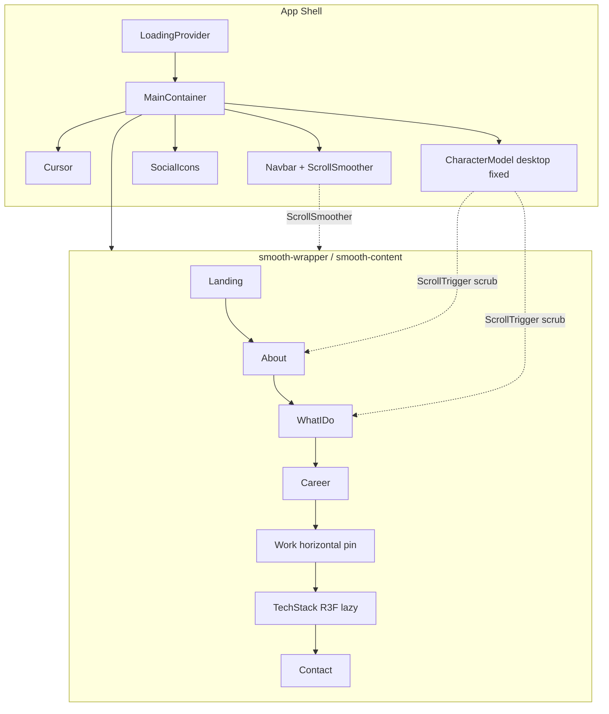
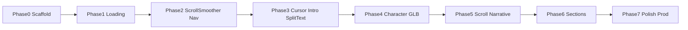

# Full-Animation Portfolio — Phase-Wise Implementation Plan

## Goal

Ship a **new original** personal portfolio that uses the **same tech stack and animation systems** as the reference project, with **your content, visual identity, and GLB**. Study techniques from this repo; do **not** copy layout, colors, typography, copy, or assets (PPL forbids cloning the full experience).

**Reference study only:** `/home/hello/Desktop/Portfolio-Website`  
**Build target:** a separate project folder (e.g. `~/Desktop/my-portfolio`) — leave this licensed repo untouched.

---

## Tech stack (match reference)

| Layer | Packages |
|-------|----------|
| App | React 18, TypeScript, Vite 5 |
| Animation | `gsap`, `@gsap/react`, **GSAP Club**: `ScrollSmoother`, `SplitText` |
| 3D character | `three`, `three-stdlib` (GLTF + DRACO + RGBE), imperative Scene (not R3F) |
| Tech playground | `@react-three/fiber`, `@react-three/drei`, `@react-three/rapier`, `@react-three/postprocessing` |
| UI extras | `react-fast-marquee`, `react-icons` |

**GSAP Club requirement:** ScrollSmoother + SplitText need a [GSAP Club](https://gsap.com/docs/v3/Installation/) license for production hosting. Do **not** ship `gsap-trial` to production. Register plugins once at app boot.

**Visual identity (must differ from reference):**
- Own CSS variables (avoid `#c2a4ff` / `#0b080c` purple-dark clone)
- Own display + body fonts (not Geist-as-default clone look)
- Own section composition, spacing, and motion timings
- Own copy, projects, socials, resume PDF
- Your GLB + your HDR (never reuse `character.enc` / reference avatar)

Credit Moncy Yohannan + source link in README if any code patterns are adapted.

---

## Architecture (target)

**Desktop (>1024):** Character is a fixed sibling outside smooth content; camera/bones/DOM `.character-model` scrub with scroll.  
**Mobile:** Character nests inside Landing; skip heavy character scroll timelines; simplify WhatIDo unlock.

---

## Assets you must prepare before Phase 4

- **Character GLB** with named clips/bones you will wire: `intro`, `typing`, `Blink`, `browup`, optional keypress clips; head bone (e.g. `spine006`), neck bone for look-down
- **HDR** environment map for character lighting
- **Work** images (and optional hover videos)
- **Tech logos** (webp) for physics spheres
- **Resume PDF**, real email/phone/social URLs
- Optional: encrypt GLB for distribution (pattern from reference `decrypt.ts`) — only if you want obfuscation

---

## Phase 0 — Project scaffold & design tokens

**Deliverable:** empty Vite app that runs; design system defined; folder map ready.

1. `npm create vite@latest` → React + TS; install exact dependency set above.
2. Folder structure:
   - `src/components/` — sections + `Cursor`, `Navbar`, `HoverLinks`, `SocialIcons`, `Loading`
   - `src/components/Character/` — `Scene.tsx`, `index.tsx`, `utils/*`
   - `src/components/utils/` — `GsapScroll.ts`, `initialFX.ts`, `splitText.ts`
   - `src/context/LoadingProvider.tsx`
   - `src/data/` — bone name lists, career/work content
   - `public/draco/`, `public/models/`, `public/images/`
3. Define CSS variables in `index.css`: colors, `--cWidth`, `--cMaxWidth`, `--vh`, accent (yours).
4. Wire fonts (CDN or self-host) — expressive, non-default stack.
5. Shell markup in `MainContainer`: `#smooth-wrapper` > `#smooth-content` + section placeholders.
6. README: setup, GSAP Club note, attribution, asset ownership.

**Validate:** `npm run dev` shows blank sections; no console errors.

---

## Phase 1 — Loading gate + app shell

**Deliverable:** loading overlay → wipe → main content visible; progress API ready for 3D later.

Mirror flow from [`LoadingProvider.tsx`](src/context/LoadingProvider.tsx) + [`Loading.tsx`](src/components/Loading.tsx):

1. Context: `{ loading, setProgress, isLoading, setIsLoading }` with fake ramp + `loaded()` snap to 100.
2. Loading UI: percent, optional marquee (`react-fast-marquee`), expand wipe CSS when complete.
3. On wipe complete (~900ms): call `initialFX()` (stub first) + `setIsLoading(false)`.
4. Mount `App` → `LoadingProvider` → `MainContainer`.

**Validate:** Fake progress 0→100 → wipe → empty page. Test on mobile width.

---

## Phase 2 — Scroll engine + navigation chrome

**Deliverable:** smooth scrolling, paused until intro; nav jumps to sections.

From [`Navbar.tsx`](src/components/Navbar.tsx):

1. Register `ScrollTrigger` + `ScrollSmoother` + later `SplitText`.
2. `ScrollSmoother.create({ wrapper: "#smooth-wrapper", content: "#smooth-content", smooth: ~1.5–1.7, effects: true })`, start `paused(true)`.
3. Export `smoother` for `initialFX` and nav `scrollTo`.
4. Fixed Navbar: brand, optional email, links ABOUT / WORK / CONTACT → `smoother.scrollTo("#id", true, "top top")`.
5. Build `HoverLinks` (duplicate text Y-swap on hover) — your styling.
6. `SocialIcons`: fixed bottom; magnetic lerp toward cursor; Resume link to PDF.
7. `data-cursor="disable"` on elements that should ignore custom cursor.

**Validate:** After manually unpausing smoother, scroll feels smooth; nav jumps work >1024.

---

## Phase 3 — Custom cursor + intro FX + SplitText

**Deliverable:** branded cursor; landing intro; scroll text reveals.

1. **Cursor** ([`Cursor.tsx`](src/components/Cursor.tsx)): GSAP lerp follow; snap/scale on interactive targets; hide on touch / `data-cursor="disable"`.
2. **`initialFX()`** ([`initialFX.ts`](src/components/utils/initialFX.ts)):
   - `overflowY: auto`, `smoother.paused(false)`, body bg, `.main-active`
   - SplitText intro on name + tagline (blur + y stagger)
   - Fade header / icons / nav
   - Infinite role-swap timeline (e.g. your two titles) — your words/timing
3. **`splitText.ts`**: on `.para` / `.title`, ScrollTrigger word/char reveal; skip if width < 900; refresh on resize.
4. Static **Landing** markup: brand-scale name, short line, role loop targets — **no** hero card clutter (one composition).

**Validate:** Load wipe → intro text animates → smoother starts → scroll reveals About titles.

---

## Phase 4 — 3D character (imperative Three.js)

**Deliverable:** your GLB loads with DRACO; lights; intro clip; mouse head look; desktop fixed / mobile in Landing.

Implement against patterns in [`Character/Scene.tsx`](src/components/Character/Scene.tsx) + utils:

| File | Responsibility |
|------|----------------|
| `character.ts` | Load GLB (plain or decrypt), DRACO, `compileAsync`, register scroll timelines |
| `lighting.ts` | Directional + point + HDR; `turnOnLights()` GSAP ramp; rim DOM element |
| `animationUtils.ts` | `AnimationMixer`; intro once; typing/keys loops; blink after delay; brow on hover |
| `mouseUtils.ts` | Head bone lerp to cursor when near top of page; else ease to scroll pose |
| `resizeUtils.ts` | Kill ScrollTriggers except Work; rebuild character + career timelines |
| `boneData.ts` | **Your** bone/clip name lists filtered for typing/brows |

Sequence:
1. Mount canvas; start progress ramp.
2. Load model → `progress.loaded()`.
3. After ~2.5s: `turnOnLights()` + `startIntro()`.
4. Desktop: Character outside smooth wrapper; Mobile: children of Landing.
5. Wire `.character-hover` for brow clip.

**Validate:** Model visible, lit, intro plays, head tracks mouse near top, no WebGL leaks on remount. Breakpoints at 1024 / 900.

---

## Phase 5 — Scroll-scrubbed character narrative

**Deliverable:** character + camera + sections linked like [`GsapScroll.ts`](src/components/utils/GsapScroll.ts) — with **your** transforms/timings.

Desktop timelines (scrub: true):

1. **Landing → About:** rotate character, pull camera, slide model X, fade landing, bring in About.
2. **About → WhatIDo:** camera pull-back, About fade, neck look-down, optional “monitor/screen” mesh opacity, reveal WhatIDo panels, rim exit.
3. **WhatIDo exit:** character Y off-screen; slight tilt.

Also: optional screenlight emissive flicker if your model has a screen material.

**Validate:** Scrubbing scroll forwards/backwards is reversible and stable; resize rebuild works.

---

## Phase 6 — Content sections (one job each)

Build sections with **your** copy; reuse animation patterns, not visual clone.

| Order | Section | Interactions to implement |
|-------|---------|---------------------------|
| 1 | **About** | Constrained width; SplitText; scroll entrance from Phase 5 |
| 2 | **WhatIDo** | Two panels; hover expand (desktop) / tap toggle (mobile); border/corner draw; unlock when scroll timeline shows them |
| 3 | **Career** | `setAllTimeline`: scrub timeline height grow, stagger fade boxes, stop CSS pulse on dot |
| 4 | **Work** | Pinned horizontal scrub (`pin` + `translateX` on flex row); unique project cards + images; optional video hover via `WorkImage` |
| 5 | **TechStack** | Lazy R3F + Rapier spheres; activate physics after scrolling past Work; pointer kinematic collider; N8AO + HDR |
| 6 | **Contact** | Email, phone, socials, ©; minimal motion |

Work ScrollTrigger `id: "work"` must survive resize kill/rebuild (same as reference).

**Validate:** Each section alone, then full-page scroll pass on desktop + mobile.

---

## Phase 7 — Polish, performance, production

1. `prefers-reduced-motion`: pause smoother effects / skip SplitText / reduce character motion.
2. Touch: no custom cursor; simplify character mouse; WhatIDo click toggles.
3. Perf: Draco, texture sizes, lazy TechStack, kill tweens on unmount, `ScrollTrigger.refresh()` after fonts/images.
4. Replace all placeholders; real meta tags / OG image in `index.html`.
5. Production GSAP Club install (drop trial).
6. `npm run build` + `preview`; Lighthouse pass on mobile; fix WebGL context loss.
7. Optional analytics only if you want it.

**Validate:** Production build hosts cleanly; no trial watermark/errors; assets are 100% yours.

---

## Implementation order summary

Do **not** start Phase 4 until your GLB + bone/clip names are known. Do **not** start Phase 5 until Phase 4 intro + mouse look work.

---

## Out of scope / hard rules

- Do not copy Moncy’s layout, accent system, landing name treatment, or 3D assets.
- Do not host with `gsap-trial`.
- Do not commit secrets or unlicensed Club plugin redistribution beyond your license terms.
- No edits inside this reference repo for the new site — new project only.

---

## Per-phase test checklist (repeat every phase)

- Desktop Chrome + Firefox
- Mobile width ≤900 and tablet ≤1024
- Resize across 1024 boundary (character mount path swaps)
- Scroll up/down through scrubbed sections (no jumps)
- Loading → intro → free scroll once
